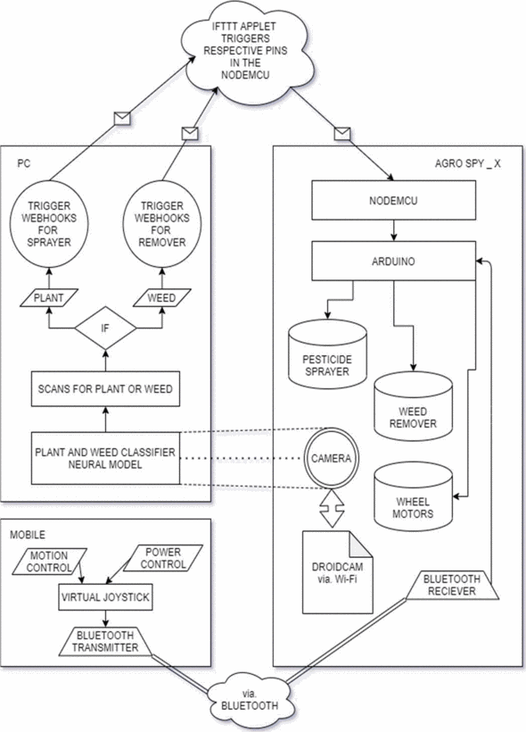

# Questions
## Question 1:
The most difficult proble i faced i while doing my final yer project where i did a fully working computer vision robot using IOT the most challenging part is to use a neural model and send signals to sensor by reading the real time feed.

